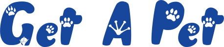

# Fullstack MERN Project

This is a fullstack project that uses the MERN technology stack.
**(MongoDB, Express.js, React.js, Node.js)**
It consists of a web application that simulates a pet adoption site, offering user registration features and pet adoption availability/requests.

## Main Features:

Data storage in MongoDB/MongoDB Atlas to ensure data persistence.
Authentication using JWT (JsonWebToken) to ensure user information security.
Password encryption using bcrypt to securely store passwords.
Node.js/Express server to provide APIs and handle client requests.
React frontend to create an interactive and responsive user interface.
Frontend created using Vite (React), aims to provide a faster and leaner development experience for modern web projects

## Resources

[Node.js](https://nodejs.org)
[MongoDB](https://docs.mongodb.com)
[Atlas](https://www.mongodb.com/atlas)
[Express.js](https://expressjs.com)
[React.js](https://reactjs.org)
[Vite](https://vitejs.dev/)

